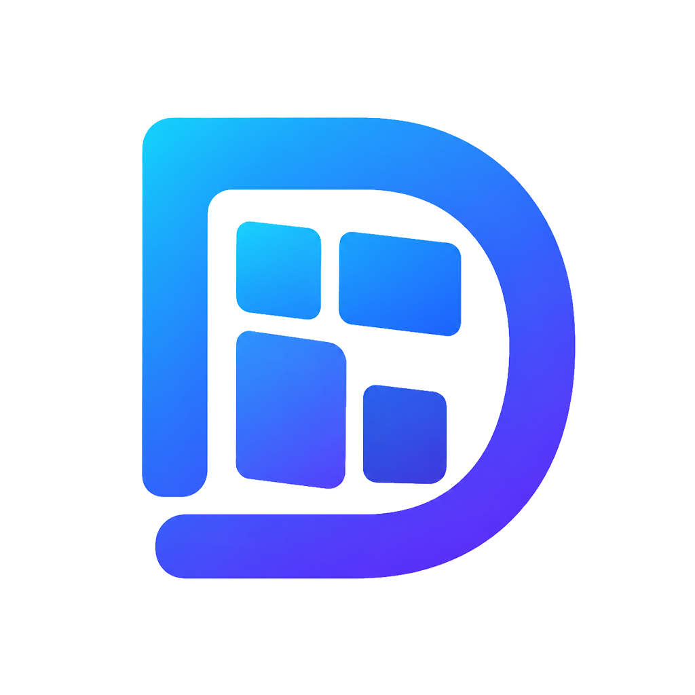

# Desto

面向 Windows 的轻量桌面整理工具。用卡片把文件、映射目录和待办放在桌面上，按显示器记住位置，尽量少占内存和空闲 CPU。



## 能做什么

- **应用卡片**：把常用文件收进桌面卡片，网格或列表打开。
- **映射卡片**：投影真实文件夹，或只保存引用而不移动源文件。
- **待办卡片**：今天、明天和历史日期，完成项可归档、搜索和导出。
- **桌面交互**：双击桌面或任务栏空白返回桌面；卡片可置顶、折叠、锁定。
- **按卡片配置**：圆角、外观、操作按钮和内容密度都是实例设置。

## 要求

- Windows 10 1809 或更高版本（含 Windows 11）
- 64 位

## 安装

从 [Releases](https://github.com/LectWolf/Desto/releases) 下载安装包。

- **稳定版**：`Desto-x.y.z-win-x64-setup.exe`
- **开发版**：`Desto-x.y.z.n-win-x64-setup.exe`，在设置 → 关于里切换通道后检查更新

安装是当前用户范围。覆盖安装前会先尝试关闭正在运行的 Desto。

## 构建

```powershell
cmake -S . -B build -DDESTO_BUILD_BENCHMARKS=ON
cmake --build build --config Release --parallel
ctest --test-dir build -C Release --output-on-failure
```

正式可执行文件在 `build/apps/Release/Desto.exe`。打安装包见 [发布流程](docs/RELEASING.md)。

## 文档

| 文档 | 内容 |
| --- | --- |
| [产品](docs/PRODUCT.md) | 边界和核心概念 |
| [架构](docs/ARCHITECTURE.md) | 模块和依赖方向 |
| [配置](docs/CONFIGURATION.md) | 设置层级与迁移 |
| [性能](docs/PERFORMANCE.md) | 预算和测量 |
| [发布](docs/RELEASING.md) | 安装包与更新通道 |
| [路线](docs/ROADMAP.md) | 当前验收事项 |

卡片行为见 [待办](docs/TODO_CARD.md)、[应用](docs/APPLICATION_CARD.md)、[映射](docs/MAPPING_CARD.md)。架构决策在 [ADR](docs/adr/README.md)。

## 许可

[GPL-3.0-or-later](LICENSE)。第三方组件见 [THIRD-PARTY-NOTICES.md](THIRD-PARTY-NOTICES.md)。
